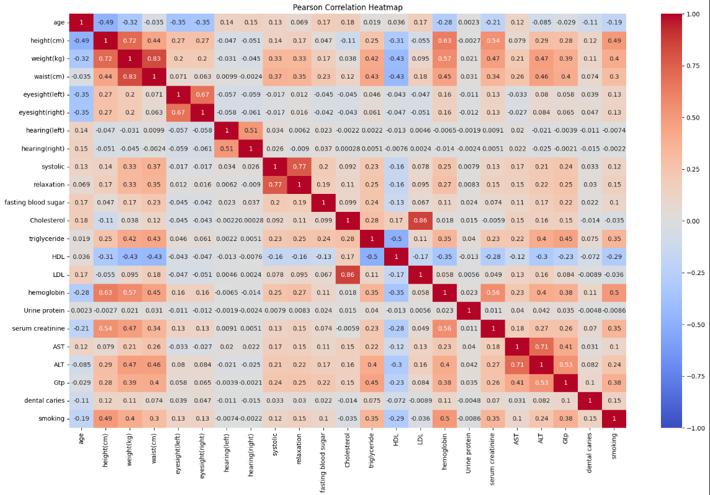
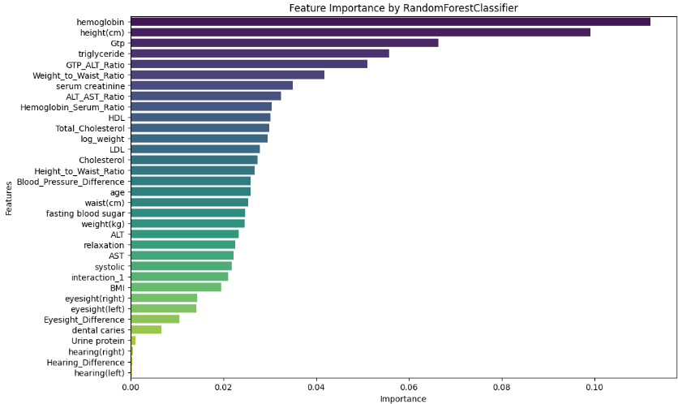

# Health Data Classification Project

This project aims to classify individuals based on their smoking habits using various health metrics. The classification model employs several machine learning techniques, including feature engineering, stacking classifiers, and model evaluation.

## Table of Contents

- [Project Overview](#project-overview)
- [Dataset](#dataset)
- [Feature Engineering](#feature-engineering)
- [Models Used](#models-used)
- [Model Evaluation](#model-evaluation)
- [Visualizations](#visualizations)
- [Installation](#installation)
- [Usage](#usage)
- [License](#license)

## Project Overview

The objective of this project is to predict whether an individual is a smoker or not based on various health-related features. The approach includes:

1. **Data Preprocessing**: Cleaning and transforming the raw data.
2. **Feature Engineering**: Creating new features from existing ones to improve model performance.
3. **Model Training**: Using machine learning algorithms to train models.
4. **Model Evaluation**: Assessing model performance using accuracy and ROC AUC score.
5. **Visualization**: Providing visual insights into the data and model performance.

## Dataset

The dataset consists of health metrics for individuals and their smoking status. The `train.csv` file is used for training the models, and the `test.csv` file is used for predictions. A sample submission file format is provided as `sample_submission.csv`.

## Feature Engineering

The following new features were created to enhance model accuracy:

- **BMI**: Body Mass Index calculated from weight and height.
- **Height to Waist Ratio**: A measure of body shape.
- **Weight to Waist Ratio**: A measure of weight relative to waist circumference.
- **Eyesight Difference**: The absolute difference between left and right eyesight.
- **Hearing Difference**: The absolute difference between left and right hearing.
- **Blood Pressure Difference**: The absolute difference between systolic blood pressure and waist measurement.
- **Total Cholesterol**: Sum of HDL and LDL cholesterol.
- **Hemoglobin to Serum Ratio**: Ratio of hemoglobin to serum creatinine.
- **Various Ratios**: Ratios of liver enzymes and other health indicators.
- **Log Weight**: Logarithmic transformation of weight.
- **Interaction Terms**: New features capturing interactions between existing variables.

## Models Used

The project employs the following machine learning models:

- **Bagging Classifier**: A meta-estimator that fits base classifiers on random subsets of the dataset.
- **Random Forest Classifier**: An ensemble learning method for classification using multiple decision trees.
- **Stacking Classifier**: Combines multiple models to improve predictive performance using a logistic regression model as the final estimator.

The models are wrapped in a **Pipeline** to streamline the preprocessing and modeling steps.

## Model Evaluation

The model's performance is evaluated using the following metrics:

- **Accuracy**: The proportion of correctly classified instances.
- **ROC AUC Score**: A measure of the model's ability to distinguish between classes.

The results are printed after fitting the model on the training set and making predictions on the test set.

## Visualizations

The project includes several visualizations to understand the data and model performance:

- **Pearson, Spearman, and Kendall Tau Correlation Heatmaps**: Visual representations of the correlations between features.
- **Feature Importance Plots**: Bar plots showing the importance of features based on different criteria (e.g., Random Forest, ANOVA, Mutual Information).

## Installation

To set up the project, you need to have Python and the following packages installed:

```bash
pip install pandas numpy scikit-learn seaborn matplotlib
